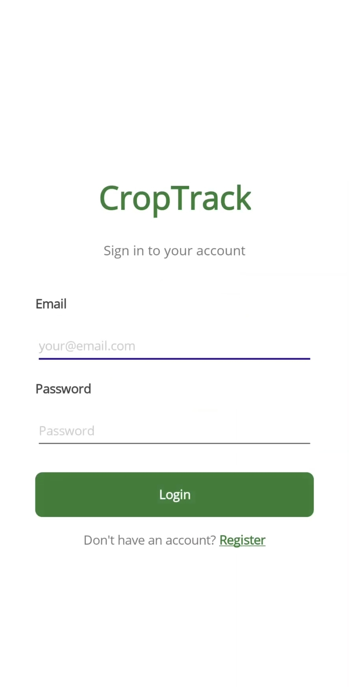
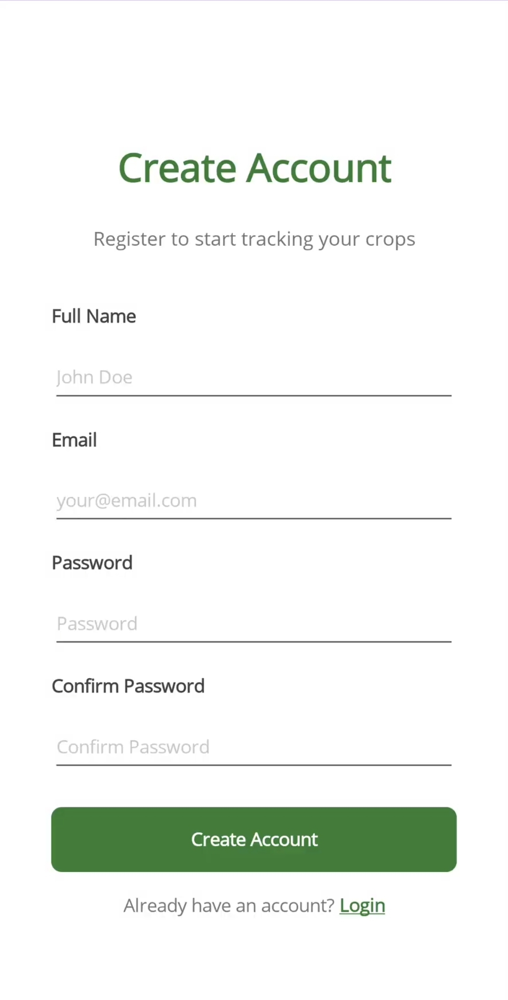
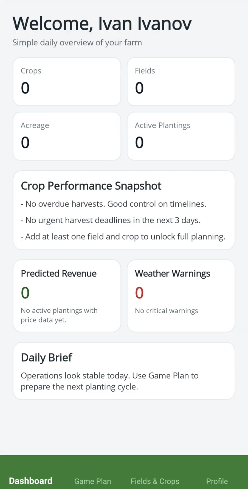
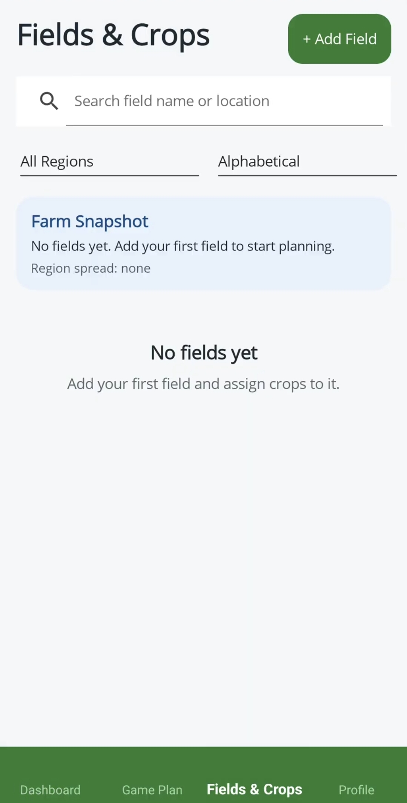
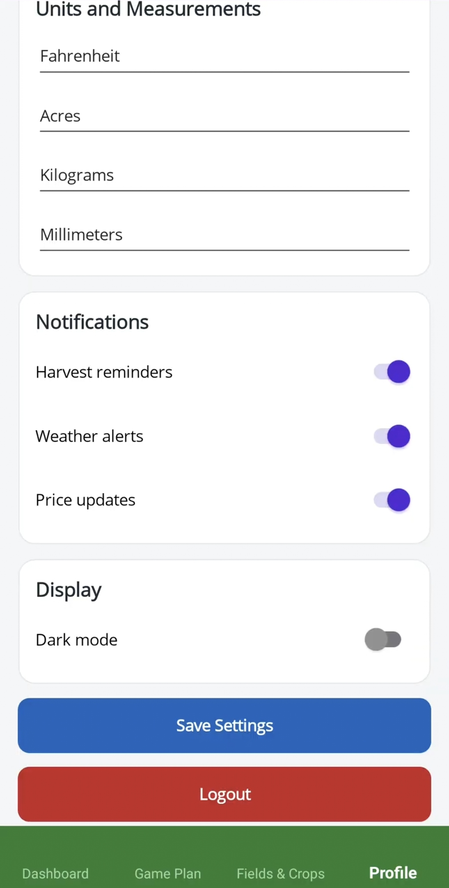

# CropTrack

CropTrack is a general agricultural management application consisting of a REST API backend and a cross-platform frontend currently in development. The backend is built with C# and ASP.NET Core, featuring a layered architecture with Service and Repository patterns, full CRUD operations, and JWT-based authentication. Data is stored in a SQL Server database with relational tables designed to support agricultural entities such as farmers, crops, and related records.

# How the app looks
 
| | | |
|--|--|--|
|  |  |  |
| Login | Register | Dashboard |
|  |  |  |
| Game Plan | Fields & Crops | Profile |
 
---
# What it does
 
When you open the app, you get a quick daily overview — how many fields you have, what's planted, upcoming harvests, and whether there's anything worth worrying about weather-wise.
 
From there you can jump into **Game Plan**, which walks you through the season step by step. It keeps track of what you've done and what's still left — setting up fields, adding crops, reviewing weather and prices before making sale decisions.
 
The **Fields & Crops** section is where you manage everything. You add fields, assign crops to them, and the app pulls recommendations from a built-in knowledge base of 20+ real crops. It checks the current temperature (via free weather data from Open-Meteo — no API key needed) and shows you which crops are closest to their ideal growing conditions.

# Tech Stack

**Backend**
- C# / ASP.NET Core Web API
- Entity Framework Core
- SQL Server
- JWT Bearer Authentication

**Frontend**
- .NET MAUI


## Running it locally
 
You'll need the [.NET SDK](https://dotnet.microsoft.com/download) and Visual Studio 2022 with the MAUI workload.
 
```bash
# Start the API
cd CropTrackApp
dotnet run
```
 
Then open `croptrack.sln` in Visual Studio and run the mobile project on an emulator or device. If you're on Android emulator, the API is at `http://10.0.2.2:<port>`.
 
---
# Internship
Started as a 60-hour internship project at [ScaleFocus](https://scalefocus.com/) and continued development afterwards.

 
# License
[MIT](LICENSE)
